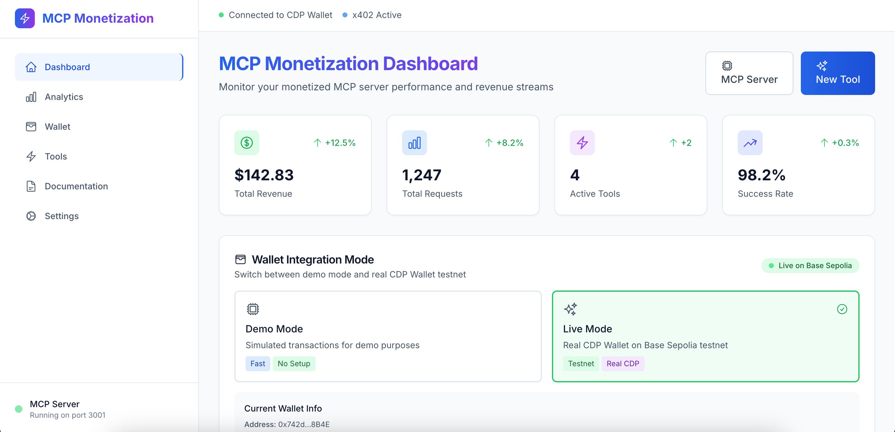
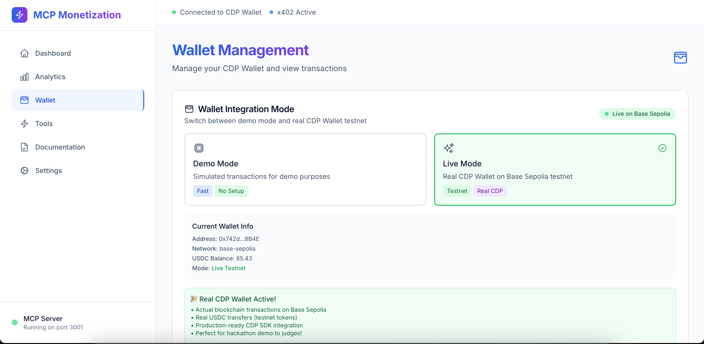
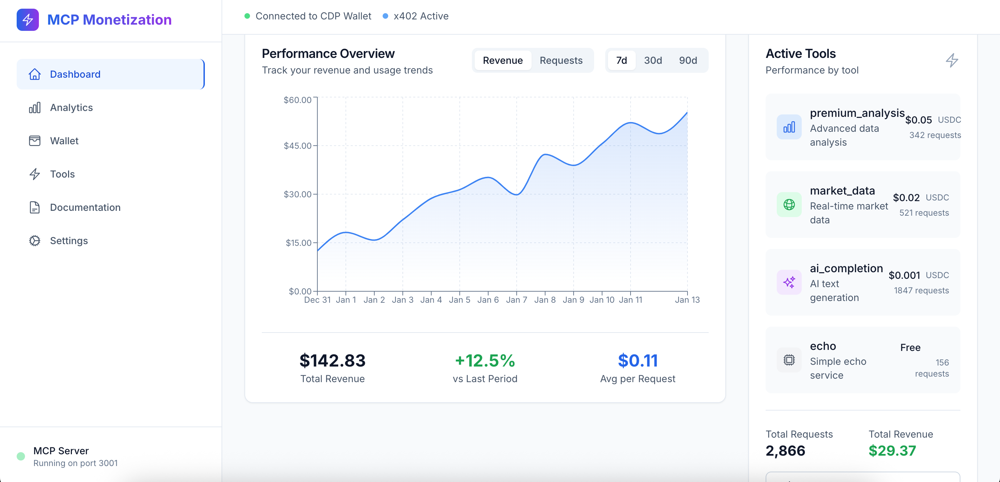

# 🏆 MCP Monetization Template

A complete, production-ready template for monetizing MCP (Model Context Protocol) servers using x402 micropayments and CDP Wallet for automated treasury management.

## 📸 Screenshots

<p align="center">
  
  
  
</p>

## 🌟 Overview

This template demonstrates the power of composable, revenue-generating infrastructure by combining:
- **x402 Protocol**: HTTP 402-based micropayments for API monetization
- **CDP Wallet**: Automated crypto treasury management and payouts
- **MCP Server**: Monetized AI/data tools with pay-per-use pricing
- **Modern Dashboard**: Beautiful UI for monitoring revenue and usage
- **Amazon Bedrock**: Optional premium AI integration (bonus feature)

### 🎯 Key Features

✅ **Complete Payment Loop**: Revenue in → Payment out  
✅ **Real-world Relevance**: Solves actual MCP monetization needs  
✅ **Composability**: Reusable flows, templates, and modular logic  
✅ **Creativity**: Novel revenue-generating primitives for AI agents  
✅ **Technical Excellence**: Clean, working code with comprehensive demo  

## 🚀 Quick Start

### Prerequisites

- Node.js 18+ and npm
- CDP API credentials ([Get them here](https://portal.cdp.coinbase.com/))
- x402 wallet setup (testnet supported)
- Optional: AWS Bedrock access for premium AI features

### 1. Clone and Install

```bash
git clone <repository-url>
cd mcp-monetization-template
npm install
```

### 2. Environment Setup

```bash
cp .env.example .env
```

Fill in your configuration:

```env
# CDP Wallet Configuration
CDP_API_KEY_NAME="your-cdp-api-key-name"
CDP_PRIVATE_KEY="your-cdp-private-key"  
CDP_NETWORK_ID="base-sepolia"

# x402 Configuration
X402_FACILITATOR_URL="https://facilitator.x402.org"
X402_WALLET_ADDRESS="your-x402-wallet-address"
X402_PRIVATE_KEY="your-x402-private-key"

# Payment Configuration
DEFAULT_PAYMENT_AMOUNT="0.01"
DEFAULT_CURRENCY="USDC"

# Optional: Amazon Bedrock (for bonus points!)
AWS_REGION="us-east-1"
AWS_ACCESS_KEY_ID="your-aws-access-key"
AWS_SECRET_ACCESS_KEY="your-aws-secret-key"
```

### 3. Start the Application

```bash
# Start both dashboard and MCP server
npm run demo

# Or start separately:
npm run dev        # Dashboard (http://localhost:3000)
npm run mcp:dev    # MCP Server (port 3001)
```

## 💡 Architecture

### Payment Flow

```
1. Client Request → MCP Server
2. Server Returns → HTTP 402 + x402 Payment Instructions  
3. Client Submits → USDC Payment via CDP Wallet
4. x402 Facilitator → Verifies & Settles Payment
5. CDP Wallet → Distributes Revenue to Stakeholders
```

### Revenue Distribution

- **70%** → Tool Developer
- **20%** → Platform Fee  
- **10%** → Network Fees

### Tech Stack

- **Frontend**: Next.js 14, TypeScript, Tailwind CSS
- **Backend**: Node.js, MCP SDK, Express-style middleware
- **Payments**: x402 Protocol, CDP Wallet SDK
- **Database**: Optional PostgreSQL for persistence
- **AI**: Optional Amazon Bedrock integration
- **UI**: Framer Motion, Headless UI, Recharts

## 🛠️ Example Tools

### Free Tools
- **Echo Service**: Simple message echoing (free tier)

### Paid Tools  
- **Premium Analysis**: Advanced data analysis ($0.05 USDC)
- **Market Data**: Real-time crypto prices ($0.02 USDC)
- **AI Completion**: Text generation ($0.001 USDC)
- **Bedrock AI**: Premium AI models ($0.01 USDC) *[Optional]*
- **Content Analysis**: AI-powered content insights ($0.05 USDC) *[Optional]*

## 📊 Dashboard Features

### Revenue Analytics
- Real-time revenue tracking
- Usage metrics by tool
- Payment success rates
- Revenue trend charts

### Wallet Management
- CDP Wallet balance monitoring
- Transaction history
- Automated payout tracking
- Multi-asset support

### Tool Configuration
- Easy tool setup and pricing
- Payment requirement toggles
- Revenue split configuration
- Usage analytics per tool

## 🔌 Integration Examples

### Adding a New Monetized Tool

```typescript
const customTool: MCPTool = {
  name: 'custom_ai_service',
  description: 'Your custom AI service',
  inputSchema: {
    type: 'object',
    properties: {
      query: { type: 'string', description: 'User query' },
    },
    required: ['query'],
  },
  handler: async (params) => {
    // Your tool logic here
    return { result: 'Custom AI response', timestamp: new Date() };
  },
  paymentRequired: true,
  paymentConfig: {
    amount: '0.02',
    currency: 'USDC',
  },
};
```

### Using the x402 Middleware

```javascript
import { x402Payment } from './lib/x402-payment';

// Express/Next.js API route
app.use('/api/premium-endpoint', 
  x402Payment.createPaymentMiddleware('0.05', 'USDC'),
  (req, res) => {
    // Your premium endpoint logic
    res.json({ data: 'Premium content', verified: req.paymentVerified });
  }
);
```

### CDP Wallet Revenue Distribution

```typescript
import { cdpWallet } from './lib/cdp-wallet';

// Automatically distribute revenue
await cdpWallet.autoDistributeRevenue('10.00', 'USDC', {
  developer: { address: '0x...', percentage: 70 },
  platform: { address: '0x...', percentage: 20 },
  contributors: [
    { address: '0x...', percentage: 5 },
    { address: '0x...', percentage: 5 },
  ],
});
```

## 🎮 Demo Use Cases

### 1. AI Agent Marketplace
- Agents charge per query and tip contributors
- Automated revenue sharing between agent creators
- Usage-based pricing for different AI models

### 2. Bounty Board Bot
- Collects entry fees for coding bounties
- Routes prize payouts automatically to winners
- Platform takes percentage for hosting

### 3. Micro-SaaS API
- Gated access via x402 payments
- Affiliate revenue splits via CDP Wallet
- Usage analytics and billing automation

## 📚 API Documentation

### MCP Server Endpoints

#### List Tools
```bash
# Get available tools and pricing
curl -X POST http://localhost:3001 \
  -H "Content-Type: application/json" \
  -d '{"jsonrpc": "2.0", "id": 1, "method": "tools/list"}'
```

#### Call Paid Tool
```bash
# Call a tool that requires payment
curl -X POST http://localhost:3001 \
  -H "Content-Type: application/json" \
  -H "X-Payment-Proof: {\"signature\":\"...\",\"transactionId\":\"...\"}" \
  -d '{
    "jsonrpc": "2.0", 
    "id": 1, 
    "method": "tools/call",
    "params": {
      "name": "premium_analysis",
      "arguments": {"data": [1,2,3], "analysisType": "correlation"}
    }
  }'
```

### Dashboard API

#### Get Metrics
```bash
curl http://localhost:3000/api/metrics
```

#### Get Wallet Info  
```bash
curl http://localhost:3000/api/wallet/info
```

## 🔧 Configuration

### MCP Server Config

```typescript
const serverConfig: MCPServerConfig = {
  name: 'your-monetized-mcp-server',
  version: '1.0.0',
  description: 'Your server description',
  port: 3001,
  tools: yourTools,
  paymentConfig: {
    enabled: true,
    defaultAmount: '0.01',
    currency: 'USDC',
    wallet: cdpWalletConfig,
  },
  x402Config: x402Config,
};
```

### Revenue Split Configuration

```typescript
const revenueConfig = {
  developer: { percentage: 70, address: '0x...' },
  platform: { percentage: 20, address: '0x...' },
  networkFees: { percentage: 10 }, // Handled automatically
};
```

## 🚀 Deployment

### Production Setup

1. **Environment Variables**: Set production values in `.env`
2. **Database**: Configure PostgreSQL for persistent storage
3. **CDN**: Deploy dashboard to Vercel/Netlify
4. **MCP Server**: Deploy to AWS/GCP/Railway with PM2
5. **Monitoring**: Set up logging and error tracking

### Docker Deployment

```bash
# Build and run with Docker
docker build -t mcp-monetization .
docker run -p 3000:3000 -p 3001:3001 mcp-monetization
```

## 🔒 Security

- **Payment Verification**: All payments verified via x402 facilitator
- **Private Key Security**: CDP wallet keys securely managed
- **Request Validation**: Input validation and rate limiting
- **HTTPS Required**: All production deployments use HTTPS
- **Audit Trail**: Complete payment and usage logging

## 🧪 Testing

```bash
# Run tests
npm test

# Type checking
npm run typecheck

# Linting
npm run lint

# Build verification
npm run build
```

## 📈 Analytics & Monitoring

### Built-in Analytics
- Revenue tracking by tool and time period
- Payment success/failure rates  
- Popular tools and usage patterns
- Wallet balance and transaction monitoring

### Integration Options
- Google Analytics for user behavior
- Mixpanel for payment funnel analysis
- Sentry for error tracking
- Custom webhooks for external systems

## 🤝 Contributing

1. Fork the repository
2. Create your feature branch (`git checkout -b feature/amazing-feature`)
3. Commit your changes (`git commit -m 'Add amazing feature'`)
4. Push to the branch (`git push origin feature/amazing-feature`)
5. Open a Pull Request

## 📄 License

This project is licensed under the MIT License - see the [LICENSE](LICENSE) file for details.

### Demo Video
[📹 Watch the Demo](https://www.youtube.com/watch?v=O6C-1J83T-o&feature=youtu.be) - See the complete payment loop in action!

## 🎉 Get Started

Ready to monetize your MCP server? Clone this template and start earning revenue from your AI tools in minutes!

```bash
git clone <repository-url>
cd mcp-monetization-template
npm install
cp .env.example .env
# Configure your credentials
npm run demo
```

Visit `http://localhost:3000` to see your monetization dashboard! 🚀
